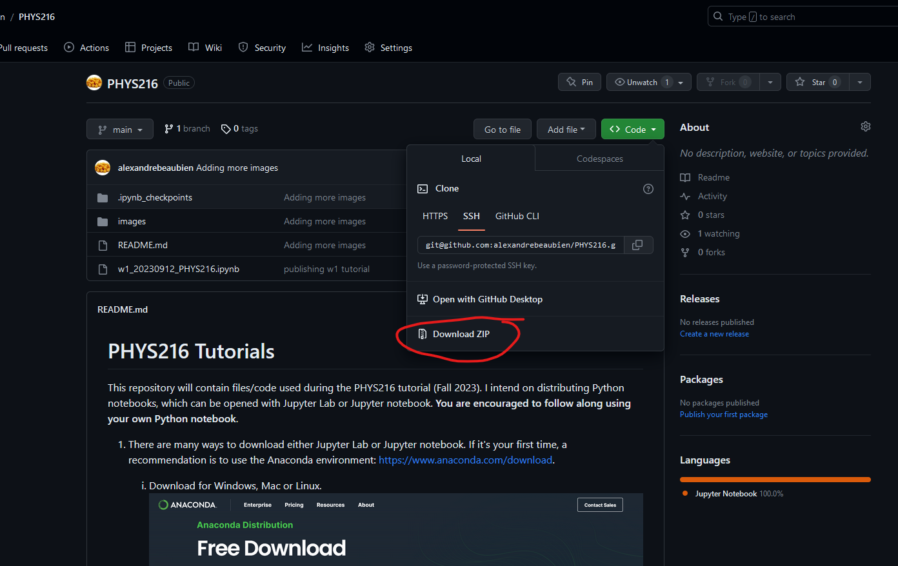

# PHYS216

This repository will contain files/code used during the PHYS216 tutorial (Fall 2023). I intend on distributing Python notebooks, which can be opened with Jupyter Lab or Jupyter notebook. **You are encouraged to follow along using your own Python notebook**.

1. There are many ways to download either Jupyter Lab or Jupyter notebook. If it's your first time, I would recommend using the Anaconda environment: https://www.anaconda.com/download.
    1. Download for Windows, Mac or Linux.
    2. Once downloaded, install Jupyter Lab from the launcher.

2. Once you have a Jupyter environment (or if you already have/know how to use a Jupyter environment), you can download the scripts directly from this github: https://github.com/alexandrebeaubien/PHYS216.

3. Open the Python notebook file with Jupyter Lab.